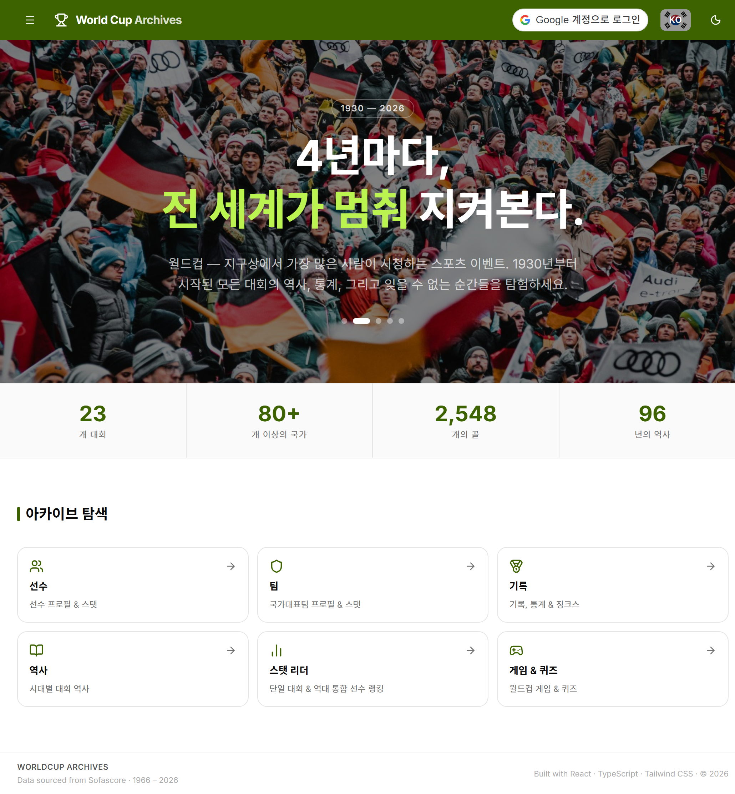
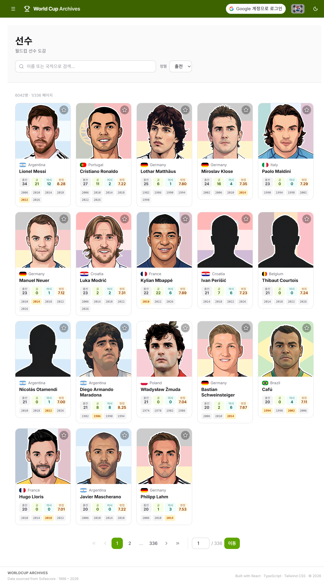
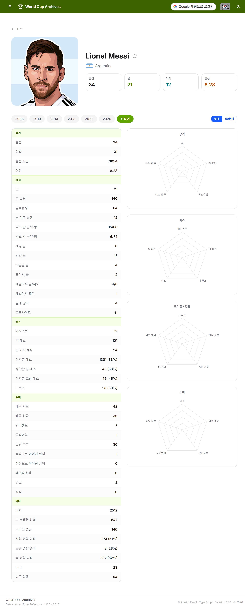
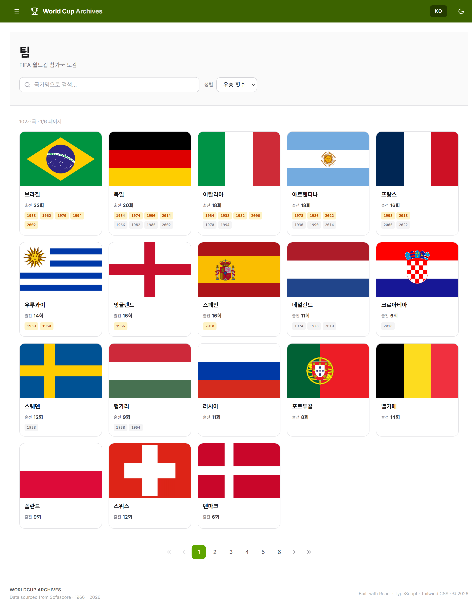
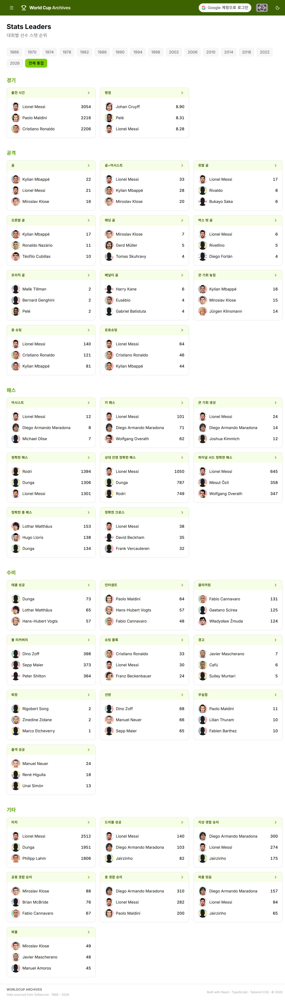

# World Cup Archives

**1966년부터 2026년까지** 모든 FIFA 월드컵 대회를 아우르는 종합 통계 아카이브입니다. 선수 프로필, 팀별 역사, 스탯 순위까지 — 데이터 수집부터 직접 구축했습니다.

🔗 **라이브 데모:** https://world-cup-archives.onrender.com

> 백엔드는 무료 인스턴스로 운영되어 일정 시간 비활성화 시 슬립 상태로 전환됩니다. 첫 요청 시 30~60초 정도 지연될 수 있습니다.

## 스크린샷

| 홈 | 선수 목록 |
|---|---|
|  |  |

| 선수 상세 | 팀 |
|---|---|
|  |  |

| 스탯 리더보드 |
|---|
|  |

## 기술 스택

**프론트엔드**
- React 19 + TypeScript
- Vite
- Tailwind CSS v4
- React Router v7
- i18next (영어 / 한국어)
- Recharts (선수 스탯 레이더 차트)
- react-markdown (History 아티클 렌더링)
- shadcn/ui + Radix UI

**백엔드**
- FastAPI (Python)
- PostgreSQL + SQLAlchemy (유저 데이터)
- JSON 파일 기반 정적 데이터 (선수·팀 스탯, 자체 스크래핑 파이프라인으로 생성)
- python-frontmatter (History 아티클 마크다운 파싱)
- Google OAuth 2.0 + JWT 자체 인증

**데이터 파이프라인**
- Playwright 기반 Python 스크래퍼로 대회별 선수·팀·스탯 데이터를 수집 및 정규화

**배포**
- Render (프론트엔드는 Static Site, FastAPI 백엔드는 Web Service, PostgreSQL은 Managed DB)

## 주요 기능

**완료된 기능**
- 🏠 대회 개요를 보여주는 홈페이지
- 👤 선수 목록 — 페이지네이션, 발음 구별 기호 무시 검색, 커리어·대회별 스탯과 레이더 차트가 포함된 상세 페이지
- 🏳️ 팀 목록 — 연도별 대회 출전 기록과 스탯이 담긴 상세 페이지
- 📊 스탯 리더보드 — 연도별/통산 다양한 스탯 카테고리 순위, 스탯별 상세 페이지
- 📜 History — 대회별 아티클 목록/상세 페이지, 마크다운 기반 콘텐츠 관리
- 🔐 Google OAuth 로그인 — 구글 계정으로 간편 로그인, JWT 기반 세션 관리
- 🌓 라이트/다크 테마
- 🌐 영어·한국어 완전 지원
- ⭐ 즐겨찾기 — 선수·팀 즐겨찾기 등록/해제

**향후 추가될 기능**
- 💬 댓글 — 페이지 댓글 작성/삭제
- 🏆 Records 페이지
- 📰 History 주제별 아티클 (역대 최다골, 이변, 규칙 변천사 등)
- 🎮 Games & Quiz 섹션
- 팀 단위 랭킹 및 포지션 기반 필터링


## 프로젝트 구조

```
world-cup-archives/
├── backend/
│   ├── main.py                      # FastAPI 앱 — 라우트 정의 및 미들웨어 설정
│   ├── requirements.txt
│   ├── auth/                         # 인증 모듈
│   │   ├── routes.py                 # /auth/google, /auth/me 라우트
│   │   ├── utils.py                  # 구글 ID Token 검증, JWT 발급/검증
│   │   └── dependencies.py          # get_current_user, get_current_user_optional
│   ├── db/                           # 데이터베이스 모듈
│   │   ├── database.py              # SQLAlchemy engine, session, Base
│   │   └── models.py                # User, Favorite, Comment 테이블 모델
│   ├── data/                         # 생성된 정적 데이터 (커밋됨, API가 런타임에 읽기만 함)
│   │   ├── players/
│   │   │   ├── {year}/               # 대회별 선수 시즌 스탯 (1966~2026)
│   │   │   │   ├── {player_id}.json
│   │   │   │   └── rankings.json     # 해당 대회 스탯 순위
│   │   │   └── total/                # 선수별 통산 스탯 + all-time 순위
│   │   ├── teams/
│   │   │   └── {year}/{team_slug}.json
│   │   ├── history/                  # History 아티클 (연도.md, frontmatter + 마크다운 본문)
│   │   ├── team-slug-map.json
│   │   ├── team-season-map.json
│   │   └── season-ids.json
│   └── scraper/                      # 데이터 파이프라인 (독립 실행, 배포 대상 아님)
│       ├── player_scraper.py
│       ├── team_scraper.py
│       ├── aggregate_players.py
│       ├── build_player_rankings_by_season.py
│       ├── build_player_rankings_all_time.py
│       ├── build_rankings.py
│       └── generate_players_data.py
│
└── frontend/
    └── src/
        ├── App.tsx
        ├── main.tsx
        ├── pages/
        │   ├── home/
        │   ├── players/
        │   │   ├── Players.tsx
        │   │   ├── PlayerDetail.tsx
        │   │   ├── PlayerCard.tsx
        │   │   ├── playersData.ts
        │   │   ├── components/
        │   │   └── hooks/usePlayerStats.ts
        │   ├── teams/
        │   ├── stats/
        │   │   ├── Stats.tsx
        │   │   ├── StatsDetail.tsx
        │   │   ├── components/
        │   │   └── hooks/usePlayerSeasonRankings.ts
        │   ├── history/
        │   │   ├── History.tsx            # 목록 페이지 (피처드 카드 + 리스트)
        │   │   ├── HistoryDetail.tsx      # 상세 페이지 (마크다운 렌더링)
        │   │   ├── types.ts
        │   │   ├── components/
        │   │   └── hooks/useHistoryList.ts, useHistoryArticle.ts
        │   ├── records/               # 준비 중
        │   └── games/                 # 준비 중
        ├── components/
        │   ├── layout/                # Header, Sidebar, Footer, Layout
        │   └── ui/                    # shadcn/ui 기반 공용 컴포넌트
        ├── contexts/                  # ThemeContext, SidebarContext
        ├── locales/{en,ko}/
        └── lib/
```

## 로컬 실행 방법

### 백엔드

환경변수 설정 (`backend/.env`):
```
DATABASE_URL=postgresql://...
GOOGLE_CLIENT_ID=...
JWT_SECRET_KEY=...
```

```bash
cd backend
pip install -r requirements.txt
uvicorn main:app --reload
```

`http://localhost:8000`에서 API 실행. `/docs`에서 인터랙티브 문서 확인 가능합니다.

### 프론트엔드

```bash
cd frontend
npm install
npm run dev
```

dev 서버는 `/api` 및 `/auth` 요청을 `http://127.0.0.1:8000`으로 프록시하므로, 백엔드를 먼저 실행해둬야 합니다.

## 데이터 출처

선수·팀 데이터는 공개된 경기 통계를 자체 Python 파이프라인(`backend/scraper/`)으로 스크래핑·가공하여 정적 JSON으로 저장하고, API가 런타임에 이를 읽어서 서빙합니다.

History 아티클은 `backend/data/history/{year}.md`에 frontmatter(메타데이터) + 마크다운 본문 형식으로 직접 작성하며, API가 `python-frontmatter`로 파싱해 서빙합니다.